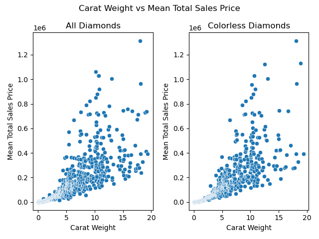
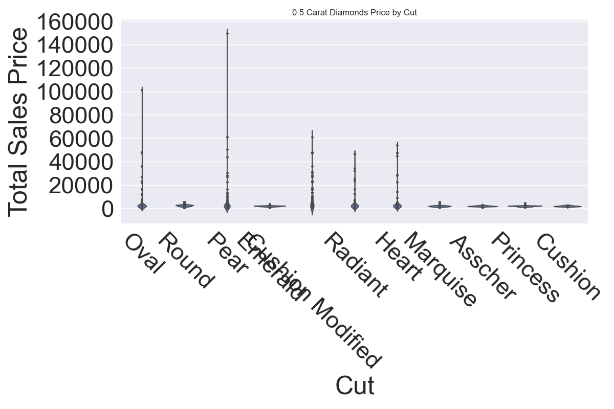
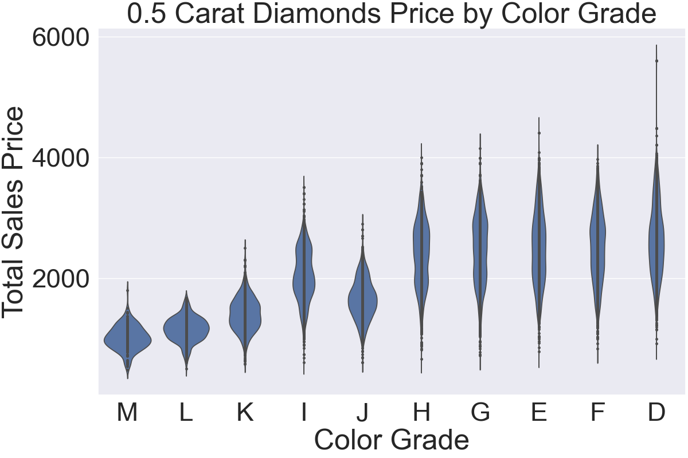
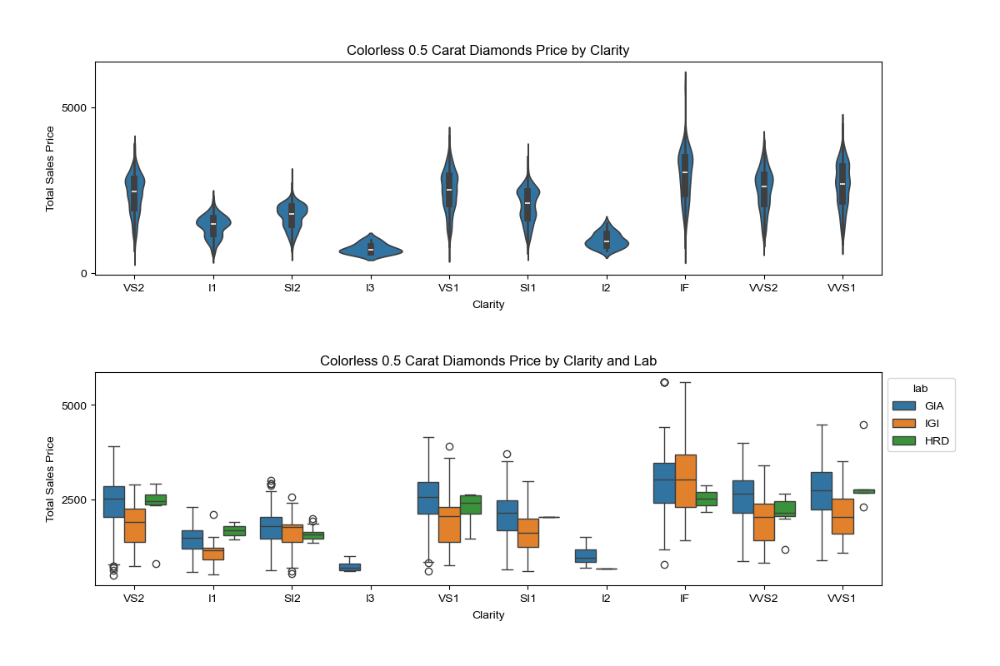
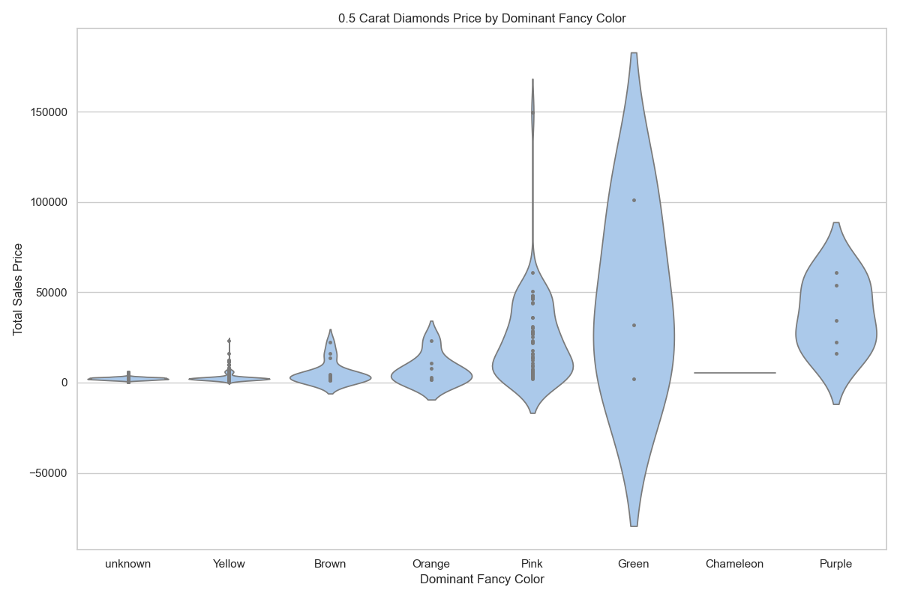
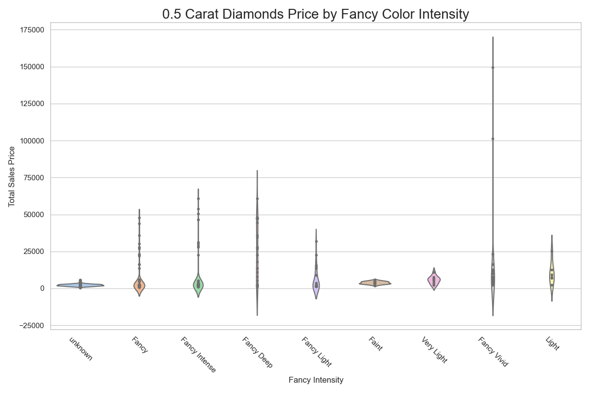

# Diamond Price Prediction EDA
 In the project, we will be exploring and analyzing the Diamonds dataset to uncover trends, patterns, and insights that influence diamond prices.

## Table of Contents
1. [Overview](#overview)
2. [Data](#data)
3. [Exploratory Data Analysis](#eda)
    * [Workflow](#workflow)
    * [Findings](#findings)
    * [Conclusion](#conclusion)
4. [Takeaway](#key-takeaway)

## **OVERVIEW**
In this project Exploratory Data Analysis is performed to understand the data better as well as visualize any trends observed so we can perform data preprocessing accordingly.
The dataset contains information about diamonds, including their carat, cut, color, clarity, and more. The goal is to build a predictive model that can accurately estimate the sales price of a diamond based on its features, which we will do in part of this project.

## DATA
The dataset used for this project is the [Diamonds](https://www.kaggle.com/datasets/hrokrin/the-largest-diamond-dataset-currely-on-kaggle) dataset from kaggle. It is quite extensive with over 210,000 entries of diamonds containing 24 features, including the 4Cs(Carat, Cut, Color, Clarity), fancy color and more.

## EDA
This notebook performs an exploratory data analysis (EDA) on the diamonds sales dataset. The goal of this project is to gain a deeper understanding of the dataset, identify key trends and patterns, and extract insights that can inform future analysis or modeling efforts.

### Workflow
The EDA is performed using Python and various libraries, including Pandas, NumPy, and Matplotlib. The analysis includes:

1. Data cleaning: handling missing and duplicate values, removing outliers, and checking for inconsistent data.
2. Feature analysis: understanding individual features and their impact on the price of diamonds.
3. Visualization: creating plots and charts to illustrate key findings and trends.

###  Findings
The EDA reveals several key insights into the diamonds sales dataset, including:

- Relationship between Carat Weight and Price

    - Clearly, as the carat weight increases the price seems to increase as well(generally). For a diamond of carat between 0 and 5, the relation seems to be more linear than carat grater than 5 where it gets more scattered.
    - Also, we can see that the fancy color of a diamond plays an important role as the mean price for colorless diamonds plot is less scattered compared to when we take all diamonds into account.

- Distribution of diamond Cuts, Colors, and Clarities

    To analyse price vs the other features, data of diamonds of the median carat weight(0.5) is selected.

     

    - 
        - Round cut diamonds seem to be more expensive than other cuts of the same carat weight among clear diamonds.

     

    - 
        - Diamonds with a noticeable color (K-M) are less expensive than colorless and near colorless diamonds.

        - Density of K-M diamonds is also the highest among the rest, which shows the supply and demand is high for them compared to the more expensive diamonds which checks out.

     

    - 
        - We can see that diamonds with higher clarity grades (IF, VVS1, VVS2, VS1, VS2) tend to be more expensive than those with lower clarity grades.
        - I2 and I3 clarities are priced significantly lower than compared to others. While we can definetly observe a difference in median price among the rest, its not as much as between I1 and (I2 and I3).

 

<!-- - Impact of cut quality on price -->
- Impact of a Fancy Color and its Intensity on Price
    - 
        - Fancy color diamonds are significantly more expensive than clear diamonds of the same carat weight
        - Among the fancy colors, Yellow and Brown are of relatively lower prices.

     

    - 
        - The price of fancy color diamonds increases as the intensity of the color increases.
        - Fancy Vivid and Fancy Intense fancy color diamonds are the most expensive.

### Conclusion
- After performing feature analysis, we can confirm that carat weight, cut, fancy color, fancy color intensity impact the Sales Price among some of the other fetures such as Measured Depth, Width and Length.

|feature|                       value|
|----------|------------|
|total_sales_price          |   1.000000|
|carat_weight               |   0.745154|
|meas_depth                 |   0.542327|
|meas_width                 |   0.541605|
|meas_length                |   0.509540|
|cut                        |   0.115150|
|fancy_color_dominant_color |   0.113884|
|fancy_color_intensity      |   0.099142|
|cut_quality                |   0.093071|

- However, clarity and color fature importance values are on the lower side, even though we observed otherwise earlier. Therefore, the data needs to be preprocessed more to get a more accurate feature analysis.

|feature                     |   value|
|---|---|
|color                       |   0.058763|
|symmetry                    |   0.037486|
|girdle_max                  |   0.036604|
|depth_percent               |   0.034261|
|fancy_color_secondary_color |   0.030144|
|fluor_color                 |   0.029675|
|lab                         |   0.023366|
|culet_condition             |   0.021211|
|girdle_min                  |   0.018174|
|polish                      |   0.013938|
|fancy_color_overtone        |   0.008101|
|culet_size                  |   0.004624|
|clarity                     |   0.001368|

- We will take these obeservations into account when modeling.

## Key Takeaway
-