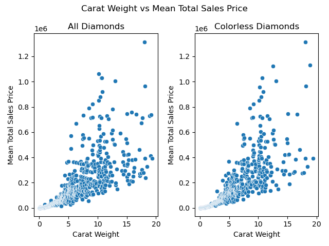
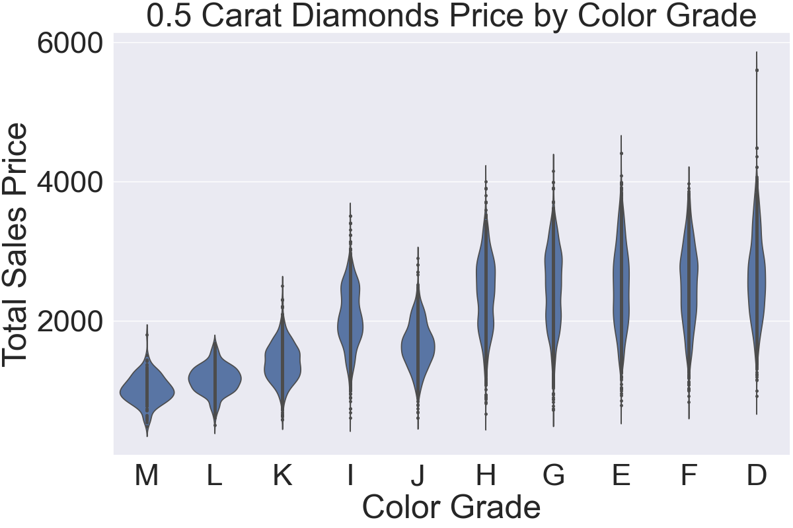
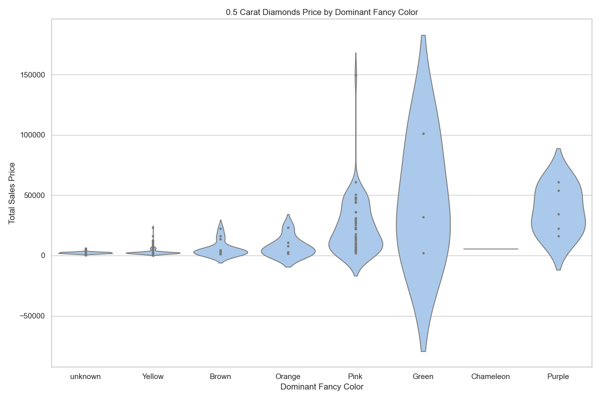

# Diamond Price Prediction - Exploratory Data Analysis

## Table of Contents
1. [Introduction](#introduction)
2. [Dataset Description](#dataset-description)
3. [Data Cleaning](#data-cleaning)
4. [Exploratory Data Analysis](#exploratory-data-analysis)
   - [Selling Price vs Carat Weight](#selling-price-vs-carat-weight)
   - [Selling Price by Cut, Color, and Clarity Analysis](#selling-price-by-cut-color-and-clarity-analysis)
   - [Selling Price vs Fancy Color Analysis](#selling-price-vs-fancy-color-analysis)
5. [Conclusion](#conclusion)
6. [Next Steps](#next-steps)

<!-- --- -->

## Introduction
This report provides a detailed Exploratory Data Analysis (EDA) of the [Diamonds Dataset](https://www.kaggle.com/datasets/hrokrin/the-largest-diamond-dataset-currely-on-kaggle). The goal is to uncover trends, patterns, and insights that influence diamond prices.

<!-- --- -->

## Dataset Description
The dataset contains over 210,000 entries with 24 features, including:
- **Carat Weight**: Weight of the diamond.
- **Cut**: Quality of the cut (e.g., Ideal, Premium).
- **Color**: Color grade (e.g., D, E, F for colorless; K-M for fancy).
- **Clarity**: Clarity grade (e.g., IF, VVS1, VS2).
- **Measured Dimensions**: Length, Width and Depth of the diamond (measured in mm)
- **Table Percentage**: The ratio of the width of the table facet to the average diameter of the diamond's girdle. (ideal ratio differs for each cut)
- **Depth Percentage**: The ratio of the diamond's height from the table to the culet to its width. (e.g., for round cut diamonds, ideal depth percentage is between 59% and 62.6%)
- **Fancy Color**: Dominant and secondary colors for fancy diamonds.

<!-- --- -->

## Data Cleaning
1. **Handling Missing Values and Removing Duplicates**: Two features- diamond fluorescence intensity and fancy color overtone have the most missing values. Since there are more than 20 other features, we can drop these two columns, along with duplicate entries in the dataset.
2. **Inconsistent Categorical Values**: Cleaning up data points with inconsistent values,(e.g., making sure colourless diamonds does not have a fancy dominant color listed)
3. **Outlier Detection for Quantitative Data**: Observe prominent outliers from scatter plots of quantitative features and remove.
Save cleaned dataset.

<!-- --- -->

## Exploratory Data Analysis

### Selling Price vs Carat Weight
- As carat weight increases, the price generally increases. For a diamond of carat between 0 and 5, the relation seems to be more linear than carat greater than 5 where it gets more scattered.
- We can also see that the fancy color of a diamond plays an important role as the mean price for colorless diamonds plot is less scattered compared to when we take all diamonds into account.
    

### Selling Price by Cut, Color, and Clarity Analysis
- **Cut**: Round cut diamonds are more expensive than other cuts.
  

   

- **Color**: Colorless diamonds (D-F) are the rarest as well as most expensive among clear diamonds. On the other hand, clear diamonds with a slight yellow tint (K-M) offer budget-friendly options.
  

   

- **Clarity**: Higher clarity grades (IF, VVS1, VVS2, VS1, VS2) are more expensive. Moreover, I2 and I3 clarities are priced significantly lower compared to others. While we can definitely observe a difference in median price among the rest, it's not as much as between I1 and (I2 and I3).
  

### Selling Price vs Fancy Color Analysis
- **Fancy color**: Diamonds are significantly more expensive than clear diamonds of the same carat. Among the fancy colors, Yellow and Brown are of relatively lower prices.
  

   

- **Fancy Color Intensity**: The price of fancy color diamonds increases as the intensity of the color increases, and we can see that Fancy Vivid, Fancy Deep and Fancy Intense fancy color diamonds are the most expensive.
  

<!-- --- -->

## Conclusion
The EDA revealed several key insights:
- **Carat Weight**: Strongest correlation with price.
- **Cut**: Round cut diamonds are more expensive.
- **Color**: Colorless diamonds are priced higher.
- **Clarity**: Higher clarity grades are more expensive.
- **Fancy Color**: Fancy color diamonds with higher intensity are significantly more expensive.

These insights were used to inform feature engineering and model selection in [this project; update link].

<!-- --- -->

## Next Steps
- **Modeling**: Use the insights from this EDA to build a predictive model.
- **Deployment**: Deploy the model as a web application for real-time price prediction.
